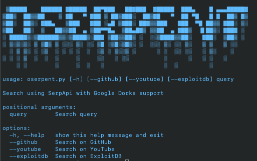
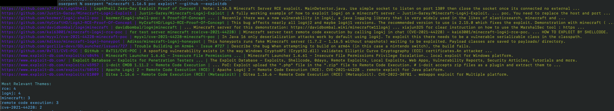

# oserpent


oserpent is a command-line tool designed for pentesters to quickly identify relevant search results using SerpApi with Google Dorks support. It fetches results from various sources like GitHub, YouTube, and ExploitDB, and provides an NLP-based analysis to highlight the most relevant themes.

## Features

- Fetch search results from GitHub, YouTube, and ExploitDB using Google Dorks.
- Analyze search results to extract the most relevant themes using NLP techniques from spacy and scikit-learn
- Display results in a colored, formatted output for better readability.
- Single line outputs optimized for grep and pipe operators.

## Requirements

- Python 3
- Virtual environment (`venv`)
- Libraries: `requests`, `pandas`, `colorama`, `spacy`, `scikit-learn`

## Installation

### 1. **Clone the repository:**

```sh
git clone https://github.com/yourusername/oserpent.git
cd oserpent
```

### 2. **Create and activate a virtual environment:**

```sh
python3 -m venv ~/oserpent-venv
source ~/oserpent-venv/bin/activate
```

### 3. **Install Dependencies**
```sh
pip install -r requirements.txt
python -m spacy download en_core_web_sm
```
### 4. Rename wrapper file
```sh
mv oserpent_wrapper.sh.example oserpent_wrapper.sh
```

### 5. **Add Serper API key to environment variables and alias**
```sh
nano ~/.bashrc  # or ~/.zshrc for zsh users
```
Add the environment variable:
Add the following lines to the end of the file, replacing YOUR_API_KEY with your actual API key:
```sh
export SERPAPI_API_KEY="YOUR_API_KEY"
alias oserpent="~/oserpent/oserpent_wrapper.sh"
```
Apply the changes:
Reload the configuration file to apply the changes:
```sh
source ~/.bashrc  # or ~/.zshrc for zsh users
```

## Usage
Use the oserp command followed by your query and optional flags to specify the search sources:

### Basic Search:
```sh
oserpent "minecraft 1.16.5 exploit poc"
```

### Search on GitHub:
```sh
oserpent "minecraft 1.16.5 exploit poc" --github
```

### Search on YouTube:
```sh
oserpent "minecraft 1.16.5 exploit poc" --youtube
```

### Search on ExploitDB:
```sh
oserpent "minecraft 1.16.5 exploit poc" --exploitdb
```

### Combined Search:
```sh
oserpent "minecraft 1.16.5 exploit poc" --github --youtube --exploitdb
```

## Example Output



## Contributing
Feel free to submit issues, fork the repository, and send pull requests. For major changes, please open an issue first to discuss what you would like to change.

## License
This project is licensed under the MIT License. See the LICENSE file for details.

## Credits
Developed by:
Eamon O'Connor

Twitter(X): @eventloghorizon
